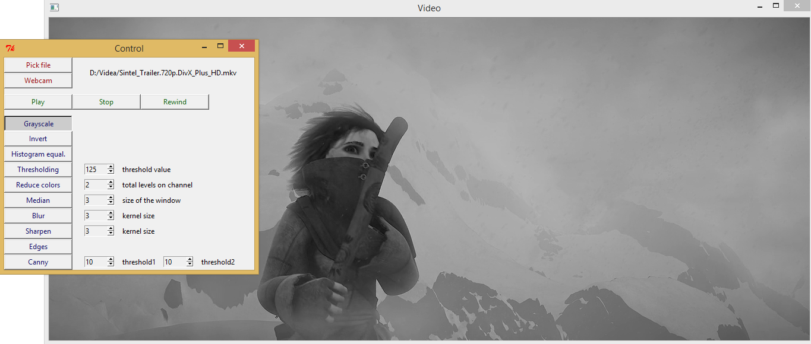
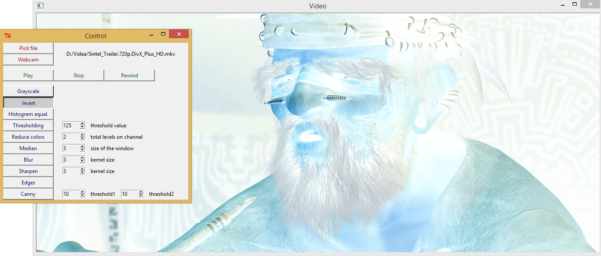

# VideoFiltering
Real-time image filters on video. Like blur, sharpen, median, Canny filter...

Application runs with Python 2, OpenCV 2.4 a NumPy 1.8.

You can download libraries from:
http://www.lfd.uci.edu/~gohlke/pythonlibs/#numpy
    version: numpy-MKL-1.8.1.win32-py2.7.exe

http://www.lfd.uci.edu/~gohlke/pythonlibs/#opencv
    version: opencv-python-2.4.9.win32-py2.7.exe

April 2014

## Authors
* Jan Bednarik
* Jakub Kvita - kvitajakub@gmail.com

## Gallery

For more look into directory [_screenshots](_screenshots/).

